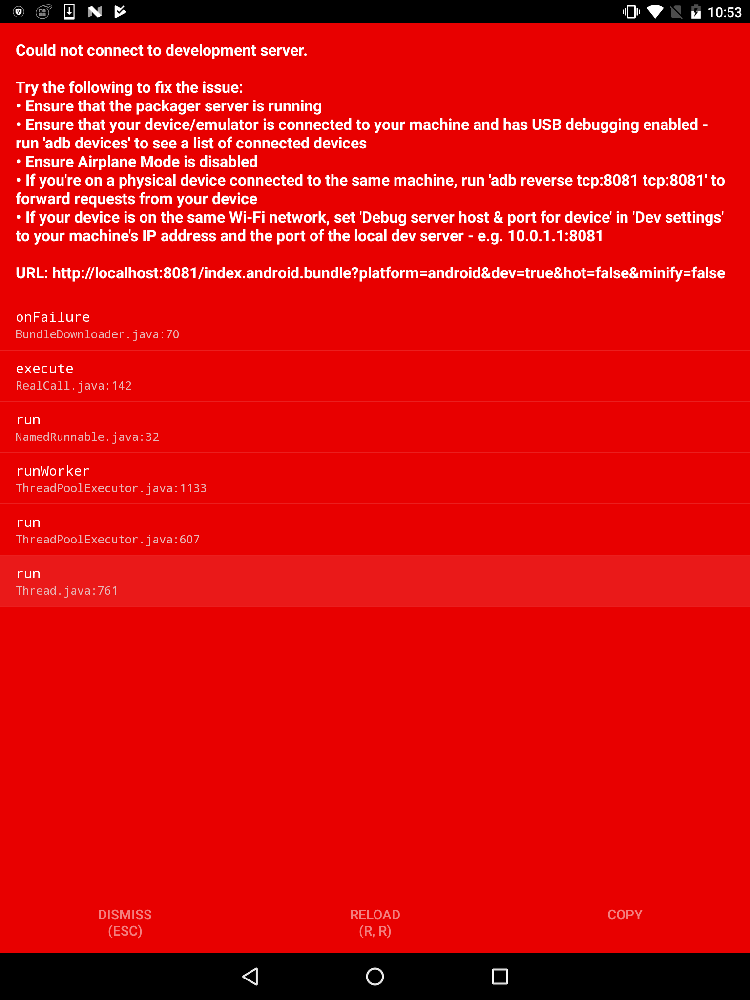

# RNServerIProgrammatically on Android
#### Problem
When we get this problem 



#### Solution
Just make sure your packager server is running at first.


Then We can set RN Server IP in programmatically without any change host & port in "Dev settings" UI.
Just modify the ```MainApplication.java``` code

1. add this method

```java
  private void setRNServerIP() {
    String RN_SERVER_HOST = "$SERVER_IP"; //your RN server IP
    SharedPreferences settings = PreferenceManager.getDefaultSharedPreferences(this);
    SharedPreferences.Editor editor = settings.edit();
    editor.putString("debug_http_host", RN_SERVER_HOST + ":8081");
    editor.apply();
  }
```

2. call this mehoud on onCreate in MainApplication.java. 
```java
  @Override
  public void onCreate() {
    super.onCreate();  
    setRNServerIP(); // add
    SoLoader.init(this, /* native exopackage */ false);
  }
```

3. Restart your app.


